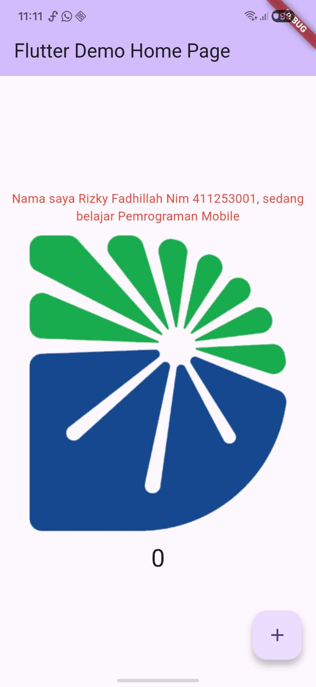
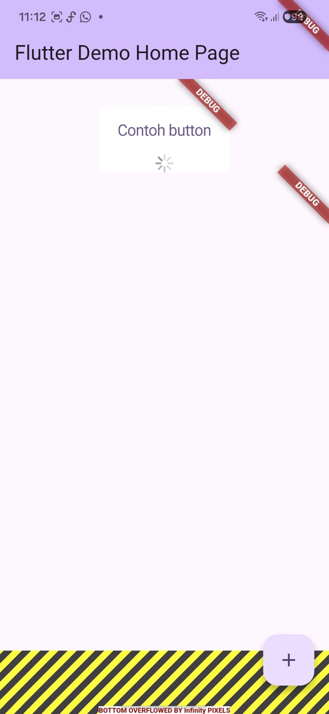
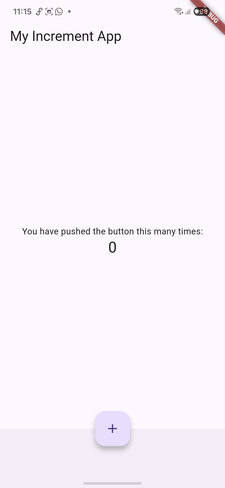
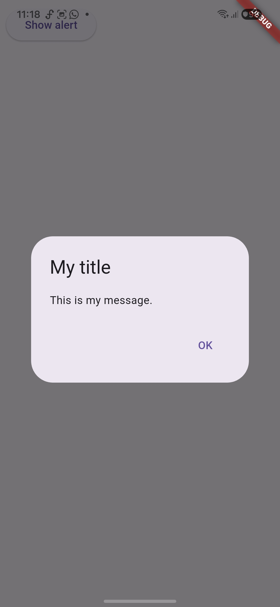
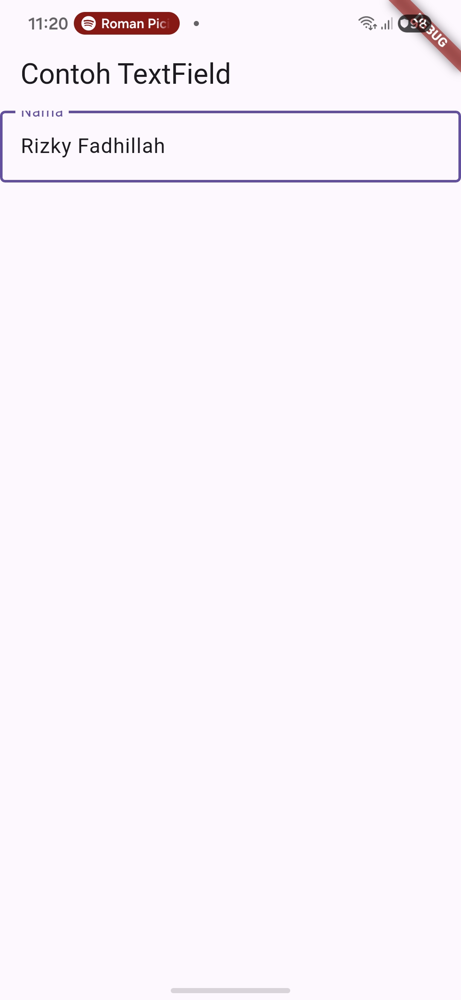
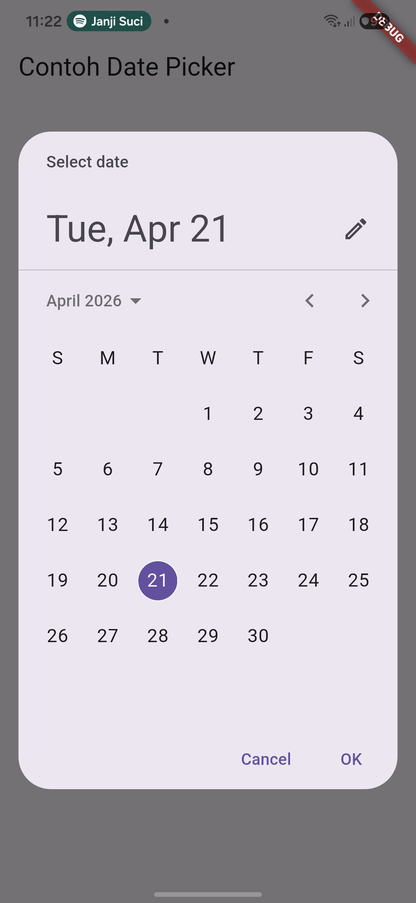

# praktikum_flutter

A new Flutter project.

## Getting Started

This project is a starting point for a Flutter application.

A few resources to get you started if this is your first Flutter project:

- [Learn Flutter](https://docs.flutter.dev/get-started/learn-flutter)
- [Write your first Flutter app](https://docs.flutter.dev/get-started/codelab)
- [Flutter learning resources](https://docs.flutter.dev/reference/learning-resources)

For help getting started with Flutter development, view the
[online documentation](https://docs.flutter.dev/), which offers tutorials,
samples, guidance on mobile development, and a full API reference.

**Nama:** Rizky Fadhillah Nim 411253001
**Program:** Pemrograman Mobile Lanjut

Praktikum 4: Menerapkan Widget Dasar
Langkah 1: Text Widget & Langkah 2: Image Widget

Praktikum 5: Menerapkan Widget Material Design dan iOS Cupertino
Langkah 1: Cupertino Button dan Loading Bar & Langkah 2: Floating Action Button (FAB)

Langkah 3: Scaffold Widget

Langkah 4: Dialog Widget

Langkah 5: Input dan Selection Widget

Langkah 6: Date and Time Pickers

